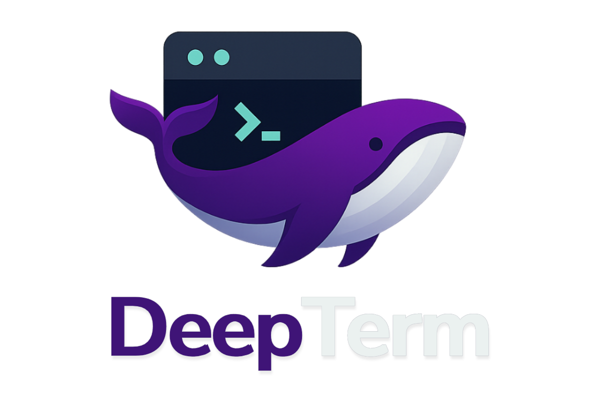
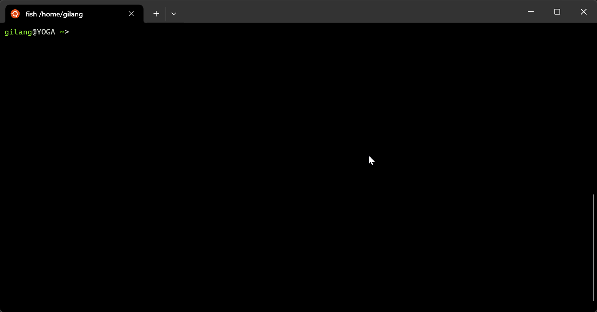

<div align="center">
    
</div>

<em><h2 align="center">Bring DeepSeek to your terminal</h2></em>

<div align="center">
    
    <a href="https://github.com/karjok/deepterm/blob/master/LICENSE"></a>
    <a href="https://github.com/karjok/deepterm/graphs/contributors"></a>
    <a href="https://github.com/karjok/deepterm/issues"></a>
    <a href="http://makeapullrequest.com"></a>
    <a href="https://star-history.com/#karjok/deepterm"></a>
    <a href="https://github.com/karjok/deepterm/fork"></a>
</div>
<p></p>
<div>
<b>DeepTerm</b> is a minimalist terminal-based interface for <a href="https://chat.deepseek.com">DeepSeek Chat</a>, designed for developers, hackers, and command-line enthusiasts.
It works by mimicking the browser-based behavior of DeepSeek Chat using Node.js and streams replies directly to your terminal. No browser. No official API. Just raw chat power.
</div>


## Features

1. **Terminal Interface**
   - Access DeepSeek Chat directly from your terminal
   - Streamed output with live typing effect
   - Scriptable: accepts piped input or `--prompt`
   - Lightweight: no GUI or browser dependency
   - Requires no account login (uses your own token)
   - Optional: save responses to file

2. **API Mode**
   - Expose DeepSeek completions via a local HTTP API
   - Built with Express.js and supports both streaming and non-streaming responses
   - Easily integrate with web frontends, bots, or automation tools
   - Customizable and self-hosted on any local or remote environment


## Requirements

- Node.js v18+
- DeepSeek Access Token (see below)


## Getting the Access Token

To use DeepTerm, you need to extract your access token manually from the browser:

1. Go to [https://chat.deepseek.com](https://chat.deepseek.com)
2. Open DevTools (F12) → Network tab
3. Look for requests to `/api/v0/users/current` or any chat endpoints
4. Copy the `Authorization` header value (starts with `Bearer ey...`)
5. Export it in your shell:

```bash
export DEEPSEEK_TOKEN="eyJ..."
```
Or

```bash
DEEPSEEK_TOKEN="eyJ..." deepterm
```


## Using DeepTerm as your Terminal Assistance

Start interactive session:

```bash
deepterm
```

One-shot prompt:

```bash
deepterm -p "What is quantum computing?"
```

Pipe input:

```bash
echo "summarize the movie Inception" | deepterm
```

Save response to a file:

```bash
deepterm -p "Write a haiku about Linux" -o output.txt
```


### CLI Options

```
Usage: deepterm [options]

Options:
  -p, --prompt "<text>"     Send one-shot prompt via CLI
  -i, --interactive         Start an interactive session
  -o, --output <file>       Save the response to a file
  -h, --help                Show help message
```


## Using DeepTerm as an API

DeepTerm also provides an optional HTTP API built with Express, allowing programmatic access to DeepSeek completions.


### Setup

Install the dependencies (if not already installed):

```bash
npm install
```

Start the API server:

```bash
npm run start
```

To run on a custom port:

```bash
PORT=8080 npm run start
```

By default, the server listens on port `3000`.


### Endpoint: `/completion`

- **Method:** `POST`
- **Content-Type:** `application/json`

#### Parameters:

| Field    | Type     | Required | Description                                                             |
|-|-|-|-|
| `token`  | `string` | Yes      | DeepSeek `Authorization` token (e.g., starts with `Bearer ey...`)       |
| `prompt` | `string` | Yes      | The prompt or question to send to DeepSeek                              |
| `sessid` | `string` | No       | (Optional) Existing chat session ID. A new session will be created if not provided |
| `stream` | `boolean`| No       | Whether to use streaming response (SSE). Defaults to `true`.            |


### Example: Streaming with `curl`

```bash
curl -N -X POST http://localhost:3000/completion \
  -H "Content-Type: application/json" \
  -d '{
    "token": "eyJ...your_token...",
    "prompt": "Explain general relativity in simple terms",
    "stream": true
  }'
```

This will return a `text/event-stream` streaming response.


### Example: Non-Streaming JSON Response

```bash
curl -X POST http://localhost:3000/completion \
  -H "Content-Type: application/json" \
  -d '{
    "token": "eyJ...your_token...",
    "prompt": "What is quantum entanglement?",
    "stream": false
  }'
```

#### Example Response:

```json
{
  "result": "Quantum entanglement is a physical phenomenon..."
}
```


### Notes

- The session ID (`sessid`) is optional. If not provided, the server will automatically create a new chat session.
- The `stream` flag is recommended for interactive applications or web frontends.
- This API is intended for personal, development, or proxy use — not for large-scale automation.


## Limitations & Risks

- **Rate Limiting and Access Restrictions:** DeepSeek may implement rate limiting or temporary restrictions if the service detects excessive or automated usage. Users are advised to interact with the service responsibly and avoid high-frequency automated requests.

- **Manual Token Provisioning:** The application requires a valid DeepSeek access token to function. This token must be manually retrieved from browser network requests. At this time, no built-in authentication or login mechanism is provided.

- **Dependency on Web Frontend Structure:** DeepTerm relies on reverse-engineered behavior from DeepSeek’s web frontend. Any changes to endpoint URLs, request structures, or authentication flows may result in tool failure until the implementation is updated accordingly.

- **Text-Only Interface:** The tool is designed for terminal-based interaction and only supports plain text responses. It does not render or interpret rich content formats such as markdown, HTML, embedded media, or syntax highlighting.

- **Limited Session Context Management:** Unless operating in interactive mode or with manual session tracking, each prompt is treated independently. Contextual continuity between prompts may be limited unless explicitly managed by the user.

- **Requires Internet Connectivity:** DeepTerm is not designed for offline use. A stable internet connection is required to communicate with DeepSeek servers and process user prompts.

- **Unofficial and Unsupported:** DeepTerm is an independent project and is not affiliated with or endorsed by DeepSeek. Use of the tool is at the user's own risk, and compatibility with DeepSeek services is not guaranteed.


## Contributing

Contributions are welcome! DeepTerm is a community-driven project, and we’re excited to see it grow with your ideas and improvements.

### Ideas for Contributions

Here are a few enhancements you might consider implementing:

- **File Upload Support**  
  Enable users to upload files and extract content to feed into prompts (e.g., for summarizing documents or parsing code).

- **Session Management UI**  
  Add richer command-line controls or a web UI for managing sessions, renaming chats, or deleting old history.

- **Markdown & Code Rendering**  
  Improve the CLI experience by detecting and formatting markdown, tables, and code blocks.

- **Multi-language Support**  
  Internationalize prompts and interface messages to support multiple languages.

Or other contributions..


### How to Contribute

1. Fork the repository
2. Create a new feature branch
3. Make your changes and test locally
4. Submit a pull request with a clear description of your changes

Before contributing, please ensure your code follows project structure and is well-documented.


### Questions or Suggestions?

Feel free to open an issue or discussion if you’re unsure how to get started, have feature ideas, or want to collaborate on larger tasks.
Let’s build something awesome together.


## Demo


## Author

Made with ❤️ by [@smfahimcp](https://github.com/smfahimcp)

## License

This project is licensed under the [**MIT License**](LICENSE).

You are free to use, copy, modify, merge, publish, distribute, sublicense, and/or sell copies of the software, provided that the original copyright notice and this permission notice are included in all copies or substantial portions.